# Grav Shortcode UI Plugin

## About

The **Shortcode UI** plugin provides several useful UI elements for Grav as _shortcodes_. As such it requires the **Shortcode Core** plugin to function.

It currently provides:

* Tabs
* Accordion
* CSS browser wrapper
* Callout for images with hover-tooltips
* Dual image comparison with drag handle
* Variety of animated text effects

## Installation

Typically a plugin should be installed via [GPM](http://learn.getgrav.org/advanced/grav-gpm) (Grav Package Manager):

```
$ bin/gpm install shortcode-ui
```

Alternatively it can be installed via the [Admin Plugin](http://learn.getgrav.org/admin-panel/plugins)

## Configuration Defaults

There is currently only one main plugin option for **Shortcode UI** and that is to set a default theme for the tabs shortcode.  As this plugin requires the **Shortcode Core** functionality there are some configuration options there that will effect this one.  For example setting the default `active` state to `false` will also cause this plugin to not function.

```
enabled: true
theme:
  tabs: default         # default|lite|badges
```

## Per-Page Configuration

You can change the tabs theme per-page by providing custom page headers:

```yaml
shortcode-ui:
    theme:
        tabs: lite
```

## Available Shortcodes

This plugin provides a variety of plugins, each with a specific purpose:

#### Tabs

> NOTE: Requires JQuery to be loaded

An example of the Tabs shortcode is as follows:

```
[ui-tabs position="top-left" active="0" theme="lite"]
[ui-tab title="First Tab"]

In tempor sed sapien eu porttitor. Aliquam cursus facilisis ante. Etiam neque nunc, blandit vel lacus et, faucibus accumsan lacus. Proin posuere varius purus quis faucibus. Quisque et enim vitae orci [placerat tincidunt](#) id ac eros. Fusce et gravida libero. 

Phasellus cursus odio ex, in **mattis lorem tincidunt** vel. Donec nibh odio, dapibus non ligula a, semper ornare massa. Nulla consectetur eu nunc sed ultrices. Integer at turpis dolor.

[/ui-tab]
[ui-tab title="Second Tab"]

In tempor sed sapien **eu porttitor**. Aliquam cursus facilisis ante. Etiam neque nunc, blandit vel lacus et, faucibus accumsan lacus. Proin posuere varius purus quis faucibus. [Quisque et enim](#) vitae orci placerat tincidunt id ac eros. Fusce et gravida libero. 

Phasellus cursus odio ex, in mattis lorem tincidunt vel. [Donec nibh odio](#), dapibus non ligula a, semper ornare massa. Nulla consectetur eu nunc sed ultrices. Integer at turpis dolor.

[/ui-tab]
[/ui-tabs]
```

##### Example

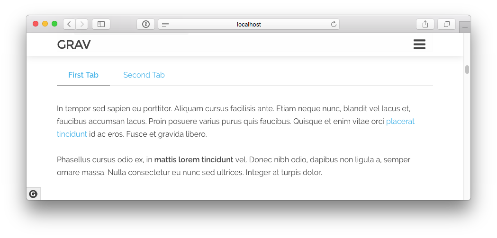

The `[ui-tabs]` shortcode has some optional parameters:

* `position` - top-left | top-right | bottom-left | bottom-right
* `active` - 0-index number of initial active tab state.  0 to (number of tabs - 1)
* `theme` - default | lite | badges

The `[ui-tab]` shortcode that defines each _tab_ has the following parameters:

* `title` - The text to display for the actual tab title

You can use whatever markdown you wish in the tab itself.  They are auto-adjusting and fully responsive.


#### Accordion

An example of the Accordion shortcode is as follows:

```
[ui-accordion independent=true open=all]
[ui-accordion-item title="Section 1"]
Bacon ipsum dolor amet beef burgdoggen shoulder, meatball prosciutto kevin brisket chicken turkey. Kevin rump pancetta short loin capicola brisket landjaeger fatback picanha pork belly ribeye. Strip steak chuck turducken kevin t-bone ribeye cupim capicola alcatra rump. Venison pork chop biltong cupim pig rump meatloaf sausage pork. Strip steak kevin tongue brisket ball tip, venison turducken flank frankfurter corned beef pancetta fatback drumstick ham. Drumstick pastrami leberkas meatball flank tongue turkey ground round pork belly doner frankfurter porchetta jowl.
[/ui-accordion-item]
[ui-accordion-item title="Section 2"]
Short loin swine shankle flank picanha andouille burgdoggen landjaeger hamburger drumstick. Beef ham tail, tri-tip flank ham hock meatball picanha corned beef t-bone shank turkey ball tip shoulder. Flank corned beef chicken, meatloaf venison ball tip ham hock tail salami jowl short ribs pork belly drumstick. Meatball chicken hamburger beef filet mignon doner pork picanha pork chop fatback rump ham tri-tip ball tip landjaeger. Sausage leberkas shoulder tongue short loin shankle. Prosciutto tri-tip frankfurter shoulder drumstick capicola. Pork loin shank strip steak pork belly tongue cow.
[/ui-accordion-item]
[ui-accordion-item title="Section 3"]
Bacon ipsum dolor amet beef burgdoggen shoulder, meatball prosciutto kevin brisket chicken turkey. Kevin rump pancetta short loin capicola brisket landjaeger fatback picanha pork belly ribeye. Strip steak chuck turducken kevin t-bone ribeye cupim capicola alcatra rump. Venison pork chop biltong cupim pig rump meatloaf sausage pork. Strip steak kevin tongue brisket ball tip, venison turducken flank frankfurter corned beef pancetta fatback drumstick ham. Drumstick pastrami leberkas meatball flank tongue turkey ground round pork belly doner frankfurter porchetta jowl.
[/ui-accordion-item]
[/ui-accordion]
```

##### Example

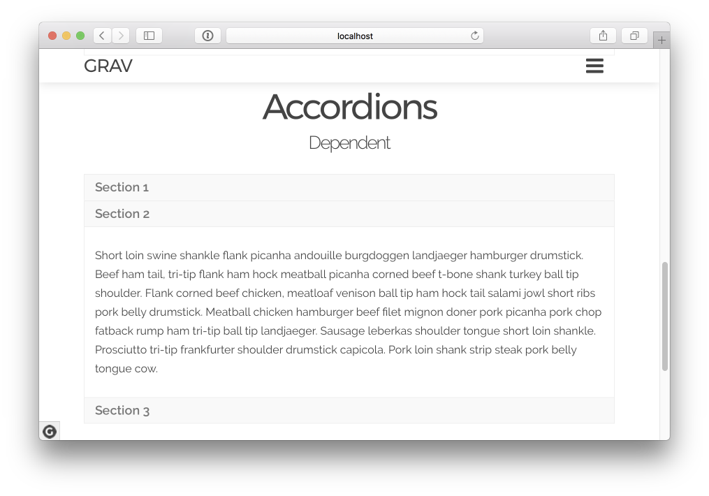

The `[ui-accordion]` shortcode has some optional parameters:

* `open` - accordion item # starting from `0` (e.g. `1` = 2nd item) | `none` = all closed | `all` = all open
* `independent` - `true` | `false` (default) = determines if panels can be opened independently from one-another

The `[ui-accordion-item]` shortcode that defines each _accordion-item_ has the following parameters:

* `title` - The text to display for the actual accordion item

#### Browser

This shortcode wraps content (image, text, whatever) with a HTML/CSS Browser frame.

```
[ui-browser address="http://getgrav.org" class="p-4"]

[/ui-browser]
```

NOTE: Address is displayed in the browser location field, and class is optional but is applied to the browser window.

##### Example

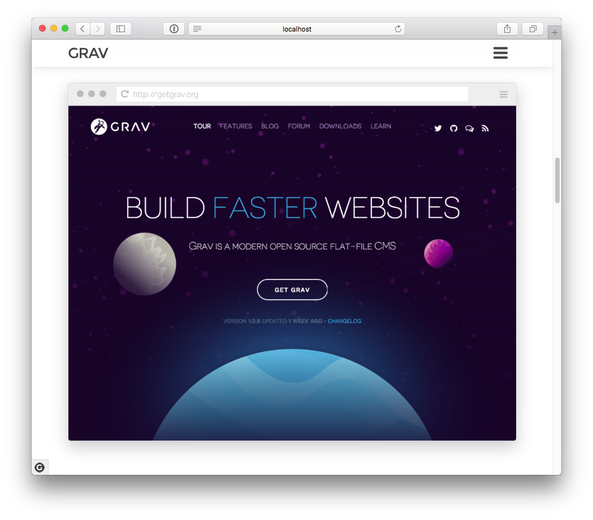

The `[ui-browser]` shortcode has some optional parameters:

* `address` - URL to display in the fake address bar of the browser

#### Callout

> NOTE: Requires JQuery to be loaded

The `[ui-callout]` shortcode is intended to be able to provide numbered callout badges on an image and allow you to hover over an image and see a tooltip describing a particular feature.  This is particularly useful when describing a user interface or provide notes or tips for an image.

Each `[ui-callout-item]` defines a particular item or tip that exists for the image.

```
[ui-callout]
[ui-callout-item title="Outlines" position="15%, 20%, se"]
This administrative panel lists displays the current theme's outlines, giving you quick access 
to edit, rename, duplicate, and delete them.
[/ui-callout-item]
[ui-callout-item title="Menu Editor" position="60%, 85%, nw"]
This administrative [color=blue]panel gives you the ability[/color] to enhance the platform's 
menu by altering styling, rearranging links, and creating menu items that sit outside of the 
CMS's integrated Menu Manager.
[/ui-callout-item]

[/ui-callout]
```

##### Example

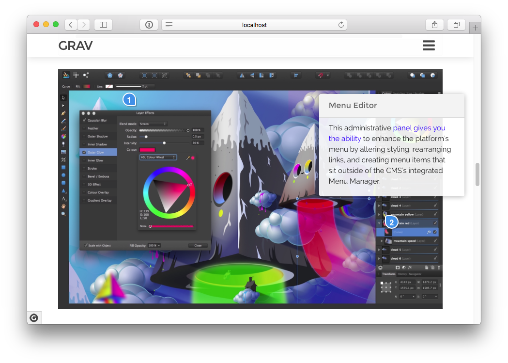

You can see this image has **2 items**

The `[ui-callout]` has no parameters.

The `[ui-callout-item]` shortcode that defines each item has the following parameters:

* `title` - The title of the callout
* `position` - format `Y%, X%, TIP_ORIENTATION`. The Y% and X% are measured from the top left corner.  That being `0%, 0%`, and the bottom right corner being `100%, 100%`.  The tip orientation should be one of these values: `ne, nw, se, sw`

You can use whatever markdown you wish in the item itself.  These will be represented as tooltips on hover.

You can also combine this shortcode with [Animate.css](https://daneden.github.io/animate.css/) by including the CSS class in your theme or page, and then adding top-level class entries:

```
[ui-callout class="pulse infinite animated"] 
...
[/ui-callout]
```

#### Image Compare

> NOTE: Requires JQuery to be loaded

This shortcode takes two images and provides a simple way to compare them via a draggable handle that lets you slide one image over the other.

Source: https://codyhouse.co/gem/css-jquery-image-comparison-slider/

```
[ui-image-compare]


[/ui-image-compare]
```

##### Example

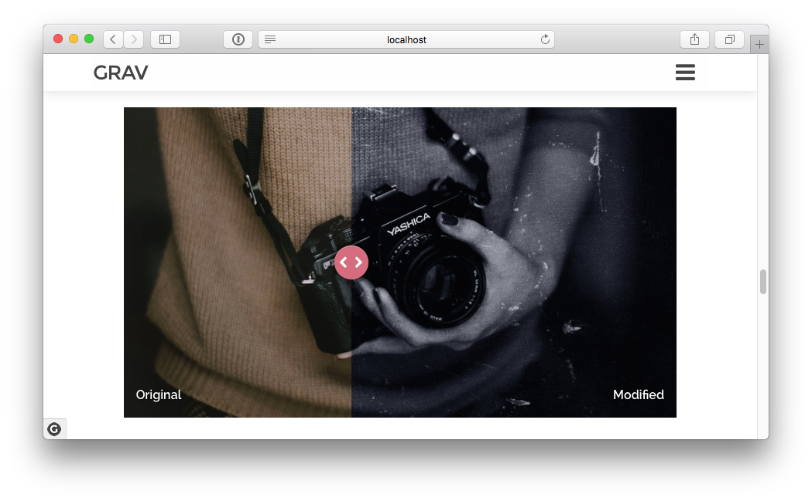

Simple provide two images, each on a newline between this shortcode.  The `Alt` text for the image will be used for the title.

#### Polaroid

This shortcode displays an image in a polaroid frame which can be customized in various ways.

```
[ui-polaroid angle="-3" margin="30px 50px 20px 0" position="left" title="How's this for embarrasing!"]

[/ui-polaroid]
```

* `angle` can be a positive or negative value that represents the degree of rotation (3 by default)
* `margin` is the margin value applied to the bounding-box.  Use standard CSS values. (browser defaults)
* `postion` can be `left` or `right` (right by default)
* `gloss` overlay effect can be `true` or `false` - (true by default)
* `title` is the text displayed below the image
* `class` optional classes to pass to the wrapper

##### Example

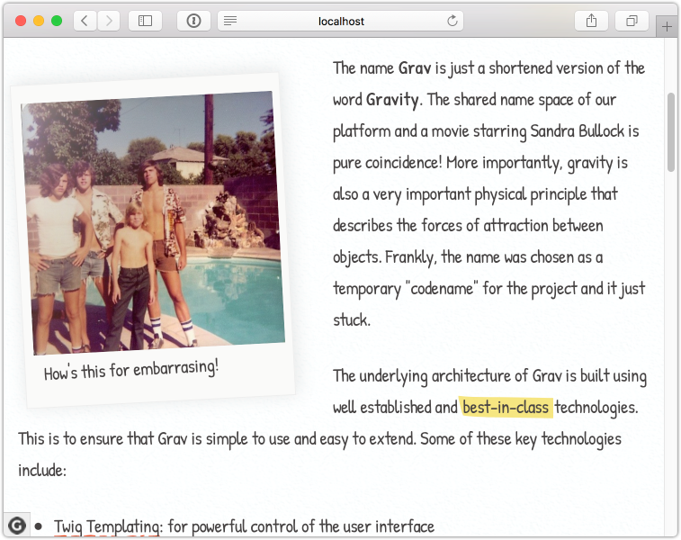

#### Animated Text

> NOTE: Requires JQuery to be loaded

This shortcode creates an attractive animated text effect with a few simple options.  By default, the animated text is appended to the end of the provided text.  However you can use the `%WORDS%` text token to insert the animated text anywhere in your string.

Source: https://codyhouse.co/gem/css-animated-headlines/

The `[ui-animated-text]` shortcode has some parameters:

* `words` - Various words in a comma separated list to animate through
* `animation` - `rotate-1 | rotate-2 | rotate-3 | type | loading-bar | slide | scale | clip | zoom | push`
* `element` - HTML element to wrap the text, for example `h1`

### Word-Based Animations

```
[ui-animated-text words="pizza, chips, steak" animation="rotate-1" element="h2"]%WORDS% is my favorite food[/ui-animated-text]
```

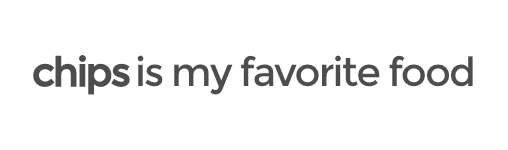

```
[ui-animated-text words="pizza, chips, steak" animation="loading-bar" element="h2"]My favorite food is[/ui-animated-text]
```

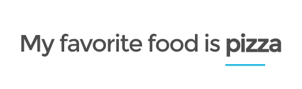

```
[ui-animated-text words="pizza, chips, steak" animation="slide" element="h2"]My favorite food is[/ui-animated-text]
```

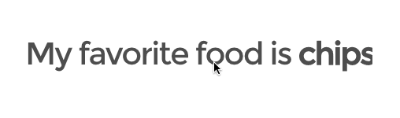

```
[ui-animated-text words="pizza, chips, steak" animation="clip" element="h2"]My favorite food is[/ui-animated-text]
```

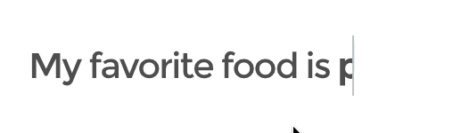

```
[ui-animated-text words="pizza, chips, steak" animation="zoom" element="h2"]My favorite food is[/ui-animated-text]
```

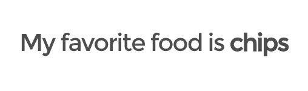

```
[ui-animated-text words="pizza, chips, steak" animation="push" element="h2"]My favorite food is[/ui-animated-text]
```

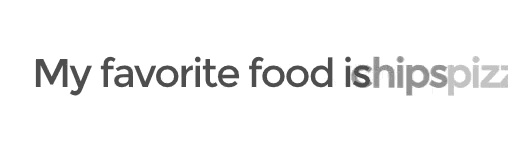

### Letter-Based Animations

```
[ui-animated-text words="pizza, chips, steak" animation="letters rotate-2" element="h2"]My favorite food is[/ui-animated-text]
```

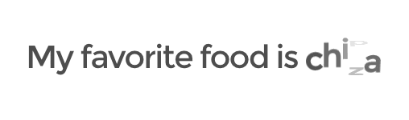

```
[ui-animated-text words="pizza, chips, steak" animation="letters type" element="h2"]My favorite food is[/ui-animated-text]
```

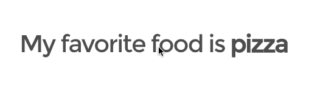

```
[ui-animated-text words="pizza, chips, steak" animation="letters rotate-3" element="h2"]My favorite food is[/ui-animated-text]
```

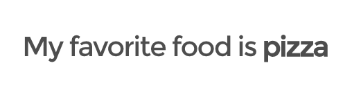

```
[ui-animated-text words="pizza, chips, steak" animation="letters scale" element="h2"]My favorite food is[/ui-animated-text]
```

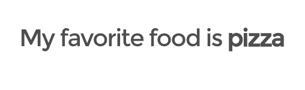
